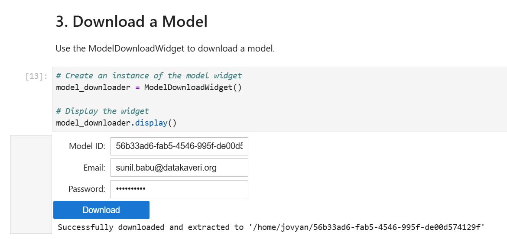
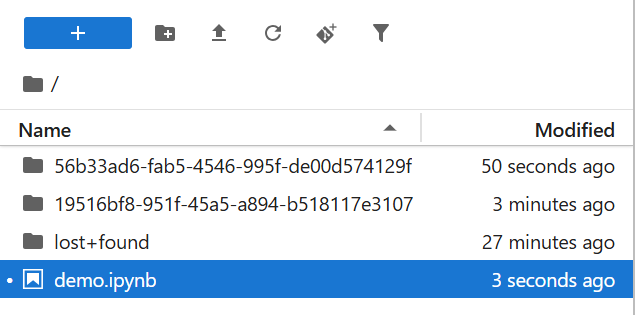

# AI Models

AI Models are ready-to-use, pre-trained machine learning models shared on TGDeX. Users can download these models or test them directly on the platform to solve specific tasks like text classification, image recognition, or prediction.

---

## AI Models Listing Page

The AI Models Listing page provides a central hub for discovering, evaluating, and accessing pre-trained AI Models. Users can:

- Quickly locate the right model via the **search bar**
- Refine the list with **sort** and **filter** controls
- Review key details on each model's card before diving into model-specific documentation or testing environments

### Search Bar
- Positioned at the top of the page
- Lets users enter keywords (e.g., "translation," "disease detection") to instantly narrow the AI Models list

### Sort Feature
- To the right of the search bar is a sort menu that reorders the model cards based on:
  - **A–Z / Z–A**: Alphabetical by model name
  - **Latest Addition**: Most recently published models first
  - **Popular Downloads**: Models with the highest download counts
- Selecting an option immediately refreshes the listing in the chosen order

### Filter Feature
The AI Model filter panel enables users to narrow the model listing by multiple criteria:

| Filter            | Options/Description                                                                 |
|-------------------|------------------------------------------------------------------------------------|
| Organisation Type | All, Public, Private, Academic Institution, Other                                   |
| Industry          | Type to search or select one or more industries (e.g., Healthcare, Education, etc.) |
| AI Model Type     | Text Classification, Image Classification, Object Detection, NER, Speech-to-Text, etc. |
| File Format       | PKL, JOBLIB, HDF5, PB, TFLITE, KERAS, PT, ONNX, SAFETENSORS, MLMODEL, etc.          |
| Permission        | Open, Restricted                                                                    |
| Last Updated      | Last 7 days, Last 30 days, Last 1 year, Custom date range                           |

### AI Model Card
Each AI model card provides a snapshot of the following key information:
- **Access Status**: "Open" or "Restricted" badge
- **Publishing Organization**
- **Title**
- **Short description**
- **Tags**
- **File format**
- **Last updated date**
- **Action Button**: "View AI Model" to open the full details and download options

<!--  -->

---

## AI Model Details

When users select an AI Model card, they arrive at the Model Detail page, which is organized into the following sections:

### Page Header & Actions
- **Breadcrumb Trail**: Shows "Home / AI Models / [Model Name]"
- **Model Title & Permission**: The model's name (e.g., "Telugu Grievance Classification Model") with an Open or Restricted badge
- **Download Button**: For Open models, users can immediately download the model archive; for Restricted models, this button becomes active once access is granted
- **Description**: A concise summary describing the model's purpose, key capabilities
- **Tags**: Keywords (e.g., "Grievance," "Classification") that show the model's domains and functions

### AI Model Details Panel
A structured metadata table presents:
- **Organisation**: Owner of the published AI model
- **Industry**: Sector classification (e.g., Public Services, Healthcare, Agriculture, or sector agnostic)
- **Uploaded By**: Individual or team (and their organisation) that submitted the model
- **Model Permission**: Access level (Open or Restricted)
- **Last Updated**: Timestamp of the most recent update
- **License**: Governing usage terms (e.g., Apache 2.0)
- **Model Type**: Task category (e.g., Text Classification)
- **File Type**: Format of the model bundle (e.g., Safetensors)
- **File Size**: Download size of complete model repository

<!--  -->

---

## AI Model Upload

### Step 1: Set Up Your AI Model
1. **AI Model Title**: Enter a concise, descriptive name that clearly reflects the model's function (e.g., "Telugu Grievance Classification Model")
2. **AI Model Permission**:
   - Open: Publicly accessible—any user can download or invoke it immediately
   - Restricted: Access requires approval from the publisher
   - Private: Visible and usable only by the publisher
3. **Metadata Entry Options**:
   - Enter Metadata Manually: Fill short/long descriptions, tags, and structured fields from scratch
   - Import from JSON: Upload a TGDeX-compatible JSON manifest to pre-populate all metadata fields

<!--  -->

### Step 2: Provide AI Model Information
Fill in the model's descriptive and structured metadata:
- **Short Description**: One- or two-sentence summary of the model's task and capabilities
- **Tags**: Up to five keywords (e.g., "Text Classification," "NLP," "Grievance")
- **Long Description**: Explain what the model does, input/output, key features (e.g., language support, customization, speed), and use cases
- **AI Model Details**:
  - Organisation
  - Organisation Type: Public, Private, Academic, NGO/Non-profit, or Other
  - Uploaded By: User name, team name, or organization
  - License: Legal terms (e.g., Apache 2.0)
  - File Size: Approximate download size (e.g., 100 MB)
  - Model Type: AI task category (Text Classification, Object Detection, etc.)
  - File Format: Bundle format(s) supported (SAFETENSORS, ONNX, PKL, etc.)
  - Industry: Sector classification or sector agnostic
  - Media URL: URL link for the AI Model (e.g., GitHub link)

<!--  -->

### Step 3: Upload Your AI Model
- If a Media URL is provided, the AI model is created automatically in Step 2
- If no Media URL is entered, proceed to Step 3 to upload files manually
- Upload relevant files according to the file format selected in Step 2
- Use "Upload More" to add multiple files
- Use "Clear All" to delete previously uploaded files and upload new ones

<!--  -->

### Step 4: Review and Publish
- Review all details including the short and long descriptions, tags, metadata fields, and uploaded files
- Confirm that the correct permission level is selected
- Once everything is verified, click **Publish** to proceed
- Open Models go live immediately and are discoverable by all users

<!--  -->

### Step 5: Approval
- Approval requests are sent to the Organisation Manager for review
- Once approved, the AI model gets published on the AI Model listing page

---

## AI Model Download

- **Open**: For 'Open' AI models, users can simply click the **Download** button on the model detail page. The model file is immediately packaged and begins downloading without any additional steps or approvals.
- **Restricted**: For 'Restricted' AI models, users must first request access by clicking the **Request Access** button on the detail page. A form will appear prompting the user to provide a brief justification. Once submitted, the request is sent to the model's publisher or organisation manager for approval. After approval, the user receives an email notification and the **Download** button becomes active on the detail page, allowing them to retrieve the model file.

---

## Using AI Models in Sandbox IDE

Once the Sandbox IDE has been instantiated, you will see a templated starter notebook with the following information:

- Type of notebook instance (CPU only or GPU instance)
- Available resources (CPU cycles, RAM, VRAM for GPU)
- Started TGDeX SDK instantiated (with imports)

The started TGDeX SDK requires you to input your credentials and the AI Model of interest and fetches the AI Model into your workspace.

Figure below shows the section of the starter sdk which allows you to download an AI Model.

Once the fetching process is complete, you will find the AI model of interest in the "In-Notebook" file interface as shown below.

The downloaded model can now be used in the library of choice (based on the metadata for that model).
