# Data Banks

This section details how users can discover, access, and leverage TGDeX's core capabilities—**Data Banks**, **AI Models**, **Potential Applications**, and the **Sandbox IDE**. It explains the search, sort, and filter tools that simplify finding the right data banks, AI models, or potential applications, and outlines the steps for uploading new assets or downloading existing ones. Finally, it also shows how to import and work with these assets inside the Sandbox IDE, enabling users to prototype, test, and deploy AI-driven solutions in a unified environment.

---

## Data Banks

Data Banks are collections of datasets made available on TGDeX. These may include information like health records, satellite imagery, public service logs, or other structured/unstructured data that can be used for analysis, research, or building AI solutions.

---

## Data Banks Listing Page

The Data Banks Listing page offers a consolidated view of all available Data Banks, complete with:

- **Search bar**
- **Sorting options**
- **Collapsible filter panel** (by organization type, department, access status, and more)

Each Data Bank is presented as a card showing:
- Title
- Publisher
- Readiness score
- File type
- Access level
- Brief description
- "View Data Bank" button to access full details or download options

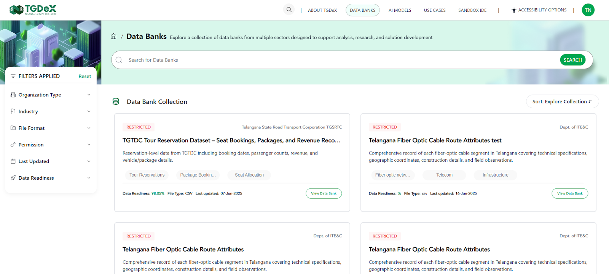

### Search Bar
- Positioned at the top of the Data Bank Listing page
- Lets users enter keywords to quickly locate specific Data Banks
- Offers instant suggestions and filters the displayed cards to match titles, descriptions, or tags

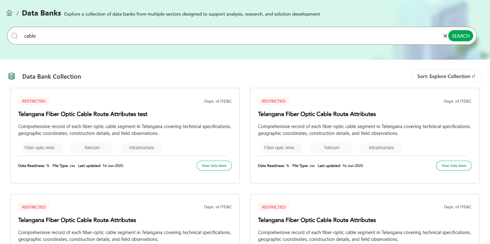

### Sort Feature
Reorder the Data Bank cards based on:
- **A–Z / Z–A**: Alphabetical ordering by Data Bank title
- **Latest Addition**: Most recently published Data Banks first
- **Popular Downloads**: Ranks by download count

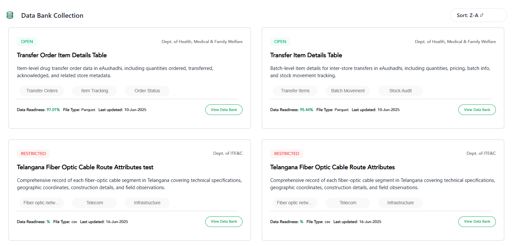

### Filter Feature
The filter panel is divided into several sections:

| Filter           | Options/Description                                                                 |
|------------------|------------------------------------------------------------------------------------|
| Organization Type| All, Public, Private, Academic Institution, Other                                  |
| Industry         | Type to search or select one or more industries (e.g., Healthcare, Education, etc.) |
| Access Status    | Open, Restricted                                                                   |
| File Type        | CSV, PDF, TXT, Shapefile, image files, etc. (multi-select)                         |
| Data Readiness   | 0–20%, 20–40%, 40–60%, 60–80%, >80%                                                |
| Last Updated     | Last 7 days, Last 30 days, Last 1 year, Custom date range                          |

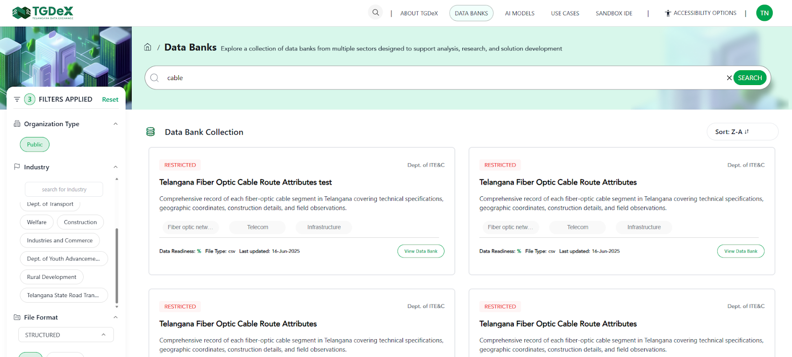

### Data Bank Card
Each Data Bank card provides a snapshot of key information:
- **Access Status**: "Open" or "Restricted" badge
- **Publishing Organization**
- **Title**
- **Short description**
- **Tags**
- **Data Readiness score**
- **File format**
- **Last updated date**
- **Action Button**: "View Data Bank"

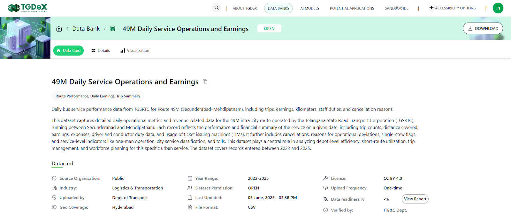

---

## Data Bank Details

Each data bank comprises a comprehensive metadata panel that describes the asset's origin, usage scope, access rules, and quality indicators. This information helps users assess relevance and technical suitability before downloading or integrating the data bank into their projects.

**Metadata fields shown:**
- **Title**: Name of the data bank
- **Long description**: In-depth narrative about the Data Bank, including context, potential use cases, ideal audience, and possible analyses
- **Organisation**: Owner of the published data bank
- **Industry**: Sector classification (e.g., healthcare, mobility)
- **Uploaded By**: User or team who submitted the Data Bank
- **Geo Coverage**: Geographic extent (e.g., "State-level (Telangana)")
- **Year Range**: Temporal span of the records (e.g., 2018–2024)
- **Data Bank Permission**: Access level—Open or Restricted
- **Last Updated**: Date and time of the most recent update
- **File Format**: Downloadable format(s) (e.g., CSV, TXT, PDF)
- **License**: Legal terms (e.g., Telangana Open Health Data License v1.0)
- **Upload Frequency**: How often the data bank is updated
- **Data Readiness**: Score reflecting completeness, documentation, and cleanliness
- **Verified By**: Reviewer/approver (typically the Organisation Manager)

### Data Bank Details & Preview
This page is split into two main areas:

- **Version Files panel (left):**
  - Collapsible list of all available file versions and associated files
  - File size, last updated timestamp, and license displayed for selected file
- **Data Bank Viewer (right):**
  - **Preview Table:** Interactive snapshot of the dataset (first few rows/columns)
  - **Column Descriptors Toggle:** Displays key statistics for each column (data type, record count, min, max, mean, std. dev.)

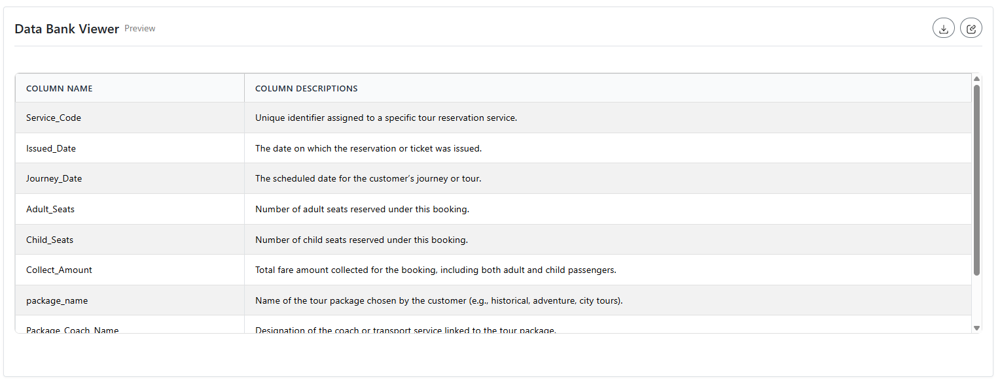

### Data Visualization
The Visualization panel lets users create basic charts directly from the Data Bank—no coding required.

- **Chart Type Selector:** Column, Line, or Pie charts
- **X-Axis / Series Picks:** Add dimensions and metrics
- **Download:** Export visualization as an image

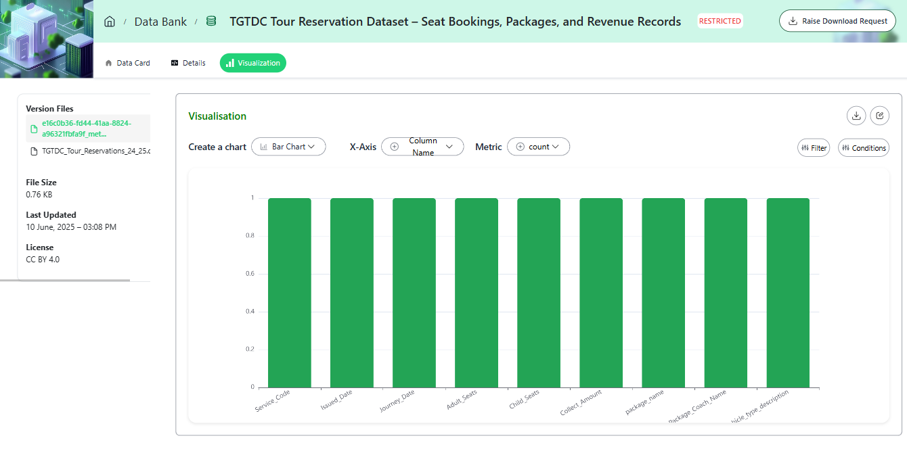

---

## Data Bank Upload

### Step 1: Set Up Data Bank
1. **Enter Title & Permission:**
   - Data Bank Title: Clear, descriptive name
   - Data Bank Permission: Choose from:
     - Open: Viewable/downloadable by all registered users
     - Restricted: Downloadable only upon publisher's approval
     - Private: Not viewable/downloadable by anyone (personal use)
2. **Choose Metadata Entry Method:**
   - Enter Metadata Manually: Fill in all fields via the form
   - Import from JSON: Upload your metadata using an existing template file

### Step 2: Enter Metadata Information
Fill out each mandatory field:
- **Short Description**: One- or two-sentence summary
- **Tags**: Add tags (e.g., "Community Health," "Satellite Imagery")
- **Long Description**: In-depth narrative, context, use cases, audience, analyses
- **Organisation**: Owner of the data bank
- **Industry**: Sector classification
- **Year Range**: Temporal span (e.g., 2018–2024)
- **Data Bank Type**: Structured/semi-structured/unstructured
- **Uploaded By**: Autofilled
- **Upload Frequency**: How often data will be updated
- **Geo Coverage**: Geographic extent
- **License**: Legal terms
- **Organisation Type**: Public, Private, Academic, or Other
- **File Format**: Format of uploaded file(s)
- **Link Related Assets**: Add associated Data Banks or AI Models

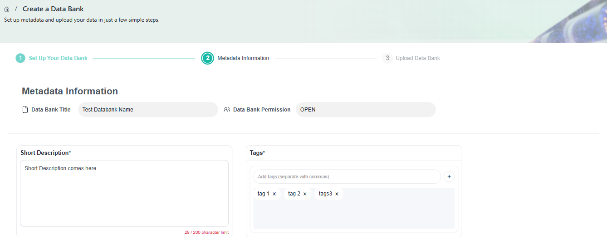

### Step 3: Upload Data Bank
- Upload relevant files according to the selected file format
- Use "Upload More" to add multiple files
- Use "Clear All" to delete previously uploaded files and upload new ones

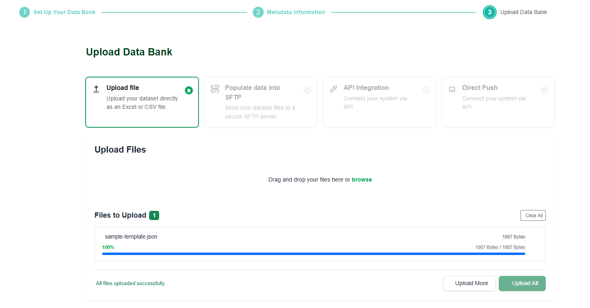

<!--  -->

### Step 4: Review and Publish
- Review all metadata fields, tags, and uploaded files
- Preview structured data (if available)
- Move back to correct any information if needed
- Click **Publish** when everything is correct

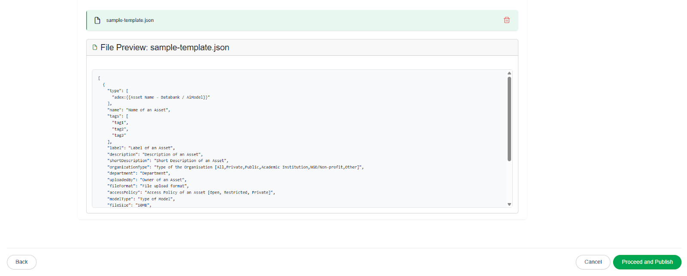

### Step 5: Approval
- Approval requests are sent to the Organisation Manager
- Once approved, the data bank is published on the TGDeX Data Bank listing page

---

## Data Bank Download

Depending on a Data Bank's permission level, the steps to download differ:

- **Open Data Banks:**
  1. Click the **Download** button on the data bank details page
  2. The entire Data Bank (all files and folders) is packaged into a single ZIP archive and begins downloading immediately

- **Restricted Data Banks:**
  1. Click the **Request Access** button on the data bank details page
  2. Fill out the request form with a brief justification
  3. Submit the request—TGDeX notifies the data bank's publisher
  4. Once approved, you'll receive an email notification, and a **Download** button appears
  5. Click **Download** to retrieve the full Data Bank

---

## Using Data Bank in Sandbox IDE

Once the Sandbox IDE has been instantiated, you will see a templated starter notebook with the following information:

- Type of notebook instance (CPU only or GPU instance)
- Available resources (CPU cycles, RAM, VRAM for GPU)
- Started TGDeX SDK instantiated (with imports)

The started TGDeX SDK requires you to input your credentials and the databank of interest, and fetches the databank into your workspace.

> **Note:** The starter SDK section allows you to download a databank directly from your notebook.

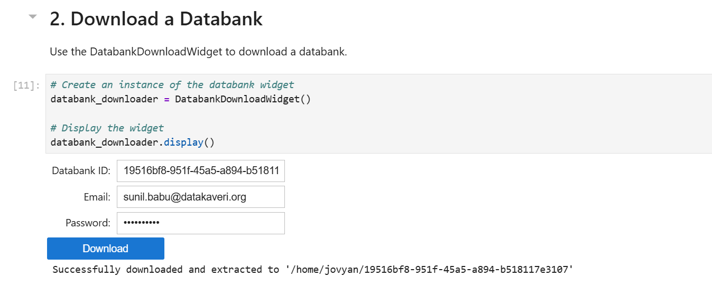

Once the fetching process is complete, you will find the databank in the "In-Notebook" file interface as shown below.

